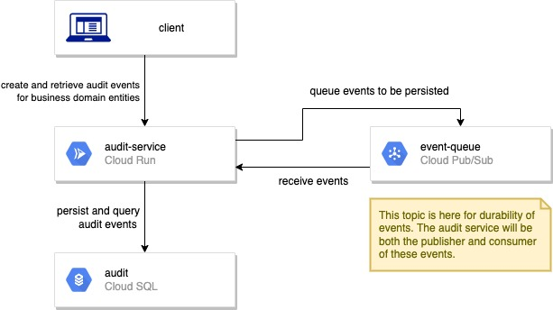
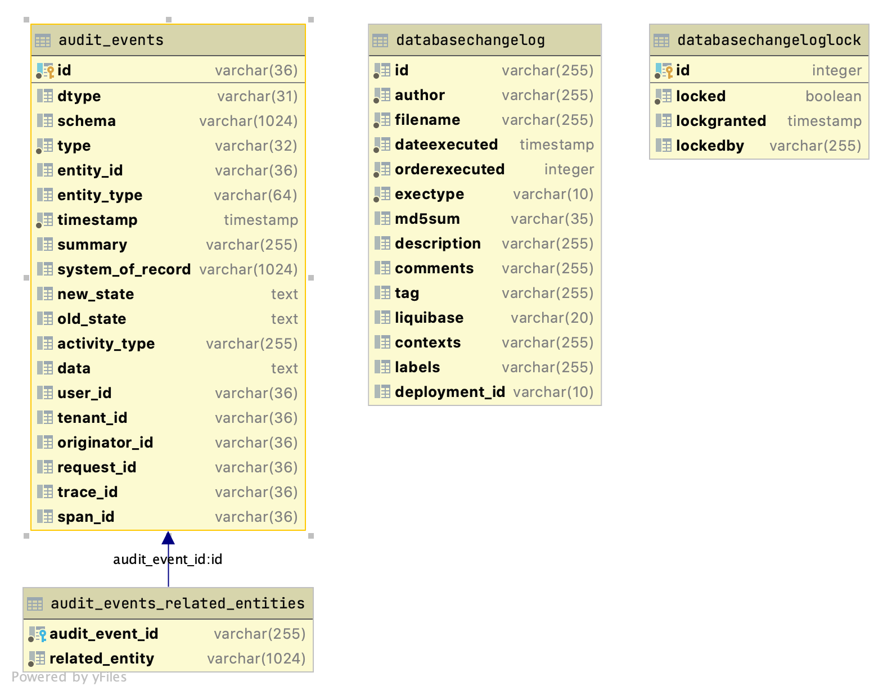

# Design & Architecture

## Service Architecture

## Database Schema

## Maintaining Diagrams

### draw.io
1. If you are looking to modify or create a diagram, 
   make sure to create & push a branch for it before 
   opening draw.io
2. [sign in to draw.io with your github credentials](https://app.diagrams.net/?mode=github)
3. select this repository and the diagram you are editing
4. commit your changes
5. also export your changes as an image to embed in this document

### Database Schema
The image was exported from the provisioned database in IntelliJ. 
